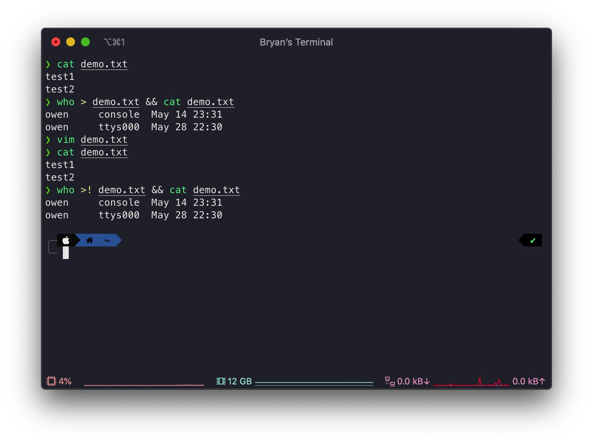
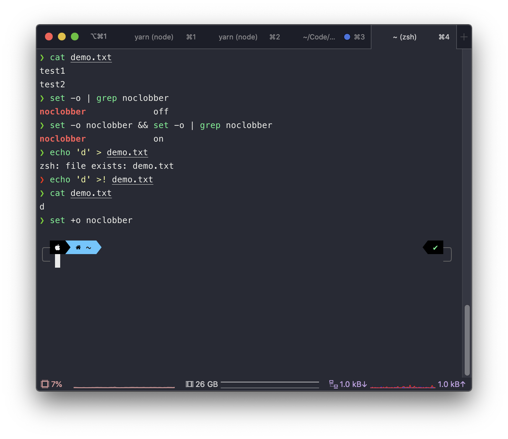

## 相遇

我在使用 [Oh My ZSH][] 的时候，会通过 `git clone` 安装一些用户自定义的插件，比如 [zsh-autosuggestions][]、[zsh-completions][] 以及 [zsh-syntax-highlighting][] 等等，它们并不会随着 Oh My ZSH 的更新而一同更新，需要我手动进入它们各自的本地仓库内执行 `git pull` 来获取更新。

由于这种更新方式太过繁琐，我便找到了一个自动更新这些自定义插件的工具—— [autoupdate-oh-my-zsh-plugins][]，因为它的功能实现只涉及到了一个文件，且代码行数并不夸张，虽然我对 shell 一知半解，也一时来了兴趣， 便索性 review 起了源代码。

也正因此这个临时起意，让我看到了一行值得深挖的代码：
```sh
echo "LAST_EPOCH=$(_current_epoch)" >! "${ZSH_CACHE_DIR}/.zsh-custom-update"
```

## 相知

因为看过的 shell 代码就少，更是第一次看到 `>!` 运算符，便去翻阅了相关文档，却没有找到关于这个运算符的介绍，比较类似的运算符是下面这个：

```sh
# 将输出重定向到 file
command > file
```

**注意**：关于 shell 数据重定向是什么，这里不再花费篇幅介绍，有兴趣的话，可以看一下这篇[文章][]。

将 `>` 与 `>!` 命令对比了一下，发现两者的效果一模一样：



可是我并没有到此为止，更不会简单地认定这两者之间在作用上没有区别。我个人更倾向于加上 `!` 有「强制执行」地意味在里面。

没有放弃寻找的我，最终在与同事的聊天时，在这个[问题][]下找到了 tcsh 中有相同的运算符；也因此，让我顺藤摸瓜找到了在 zsh 中使用 `>!` 运算符的介绍：[clobber on redirect][]。

文档中是这样介绍 `>!` 的：
> Same as >, except that the file is truncated to zero length if it exists, even if CLOBBER is unset.

意思是说，如果 zsh 在没有设置 CLOBBER 的情况下，即 `noclobber` 的状态为 `off` 时，`>!` 与 `>` 完全相同；但 `noclobber` 的状态为 `on` 时，`>` 不能重定向到已经存在的文件，但 `>!` 可以。如果你认为这段话很绕的话，可以看下图：



## 相忘于江湖

搞清楚了它们之间的区别，心里总算爽快了些，但是事情还没有完；在寻求答案的过程中，我也了解到，实际上 `>!` 是不符合 POSIX 标准的，有可能会出现兼容性问题。

正常来说，如果想要达到 `>!` 运算符的效果，可以使用符合 POSIX 标准的 `>|` 运算符来代替；因此，我又借机水了一个 [PR][]。

**注意**：关于 `>|` 的详细介绍，可以在这个[文档][]中查阅。

[Oh My ZSH]: <https://github.com/ohmyzsh/ohmyzsh> "Oh My ZSH 的 repository"

[autoupdate-oh-my-zsh-plugins]: <https://github.com/TamCore/autoupdate-oh-my-zsh-plugins> "autoupdate-oh-my-zsh-plugins 的  repository"

[clobber on redirect]: <http://zsh.sourceforge.net/Doc/Release/Redirection.html> "clobber on redirect 的文档介绍"

[PR]: <https://github.com/TamCore/autoupdate-oh-my-zsh-plugins/pull/9> "Replace the `>!` operator with the `>|` operator..."

[zsh-autosuggestions]: <https://github.com/zsh-users/zsh-autosuggestions> "zsh-autosuggestions 的 repository"

[zsh-completions]: <https://github.com/zsh-users/zsh-completions> "zsh-completions 的 repository"

[zsh-syntax-highlighting]: <https://github.com/zsh-users/zsh-syntax-highlighting> "zsh-syntax-highlighting 的 repository"

[文档]: <https://pubs.opengroup.org/onlinepubs/9699919799/utilities/V3_chap02.html#tag_18_07_02> "2.7.2 Redirecting Output"

[文章]: <https://www.cnblogs.com/chengmo/archive/2010/10/20/1855805.html> "输入重定向与输出重定向详细分析"

[问题]: <https://stackoverflow.com/questions/6762348/what-do-and-do-in-tcsh> "What do >! and >>! do in tcsh"
