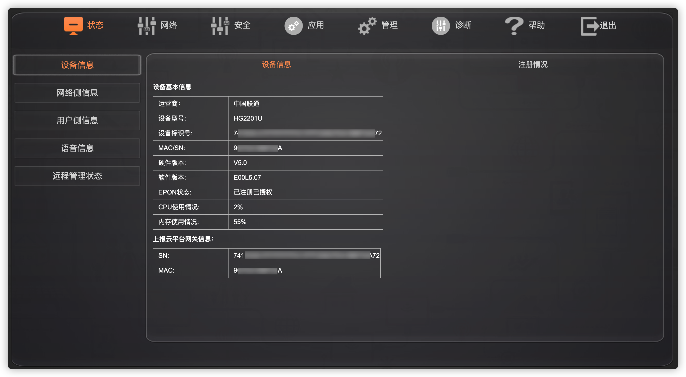
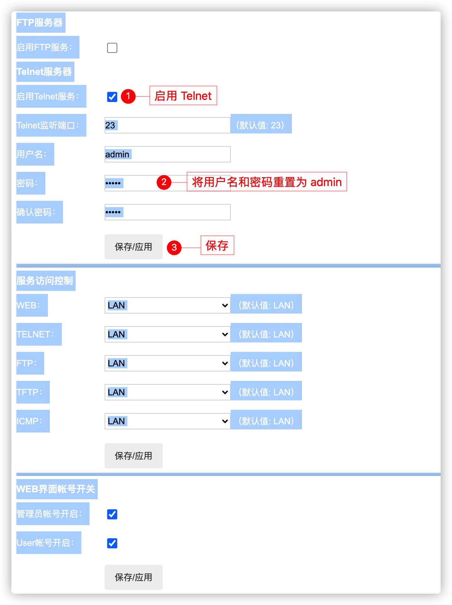
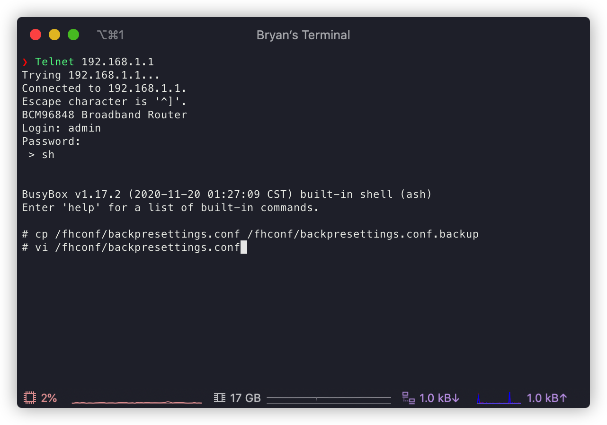
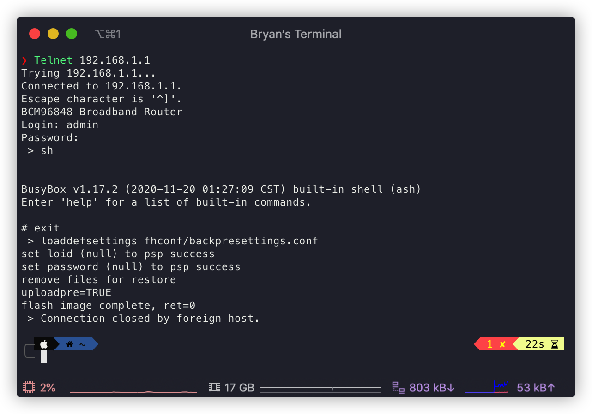

**注：本文支持 E00L5.02 以上版本的桥接**

> 将光猫改为桥接模式，使用性能较强的无线路由器连接光猫设置上网，由于路由器的硬件配置较高，网络转发能力较强，所以网络传输速度更快、稳定性更强，特别是可以保证多个联网设备同时稳定、高速连接网络，不掉线，而且无线网络覆盖能力更强。

## 一些信息说明

运营商：北京联通

设备型号：烽火HG2201U

硬件版本：V5.0

软件版本：E00L5.07



## 操作步骤

1. 在浏览器中访问光猫 Web 管理页面，默认是 http://192.168.1.1 ，输入光猫背面的密码
2. 访问 http://192.168.1.1/servmngr.html
    1. <kbd>ctrl</kbd> + <kbd>a</kbd> 全选页面才可以看到表单 Label（因为字体背景颜色都是白色），macOS 下是 <kbd>command</kbd> + <kbd>a</kbd>
    2. 启用 Telnet 服务，为了防止用户名和密码被改动过，请将其手动重置为 `admin`（清空重输即可）
    

3. 修改后即可使用 Telnet 登录光猫，如需要安装 Telnet 请自行搜索；打开终端做如下操作
    1. `Telnet 192.168.1.1`，输入用户名和密码
    2. 输入 `sh` 回车进入 shell
    3. 输入 `cp /fhconf/backpresettings.conf /fhconf/backpresettings.conf.backup` 回车备份配置文件（也可以在 Web 管理界面登陆状态下，访问 http://192.168.1.1/loadPresettings.html 来还原预设配置）

4. `vi /fhconf/backpresetting.conf` 回车，按 <kbd>i</kbd> 键，编辑配置文件：
  
    1. 搜索 `<WANConnectionDevice instance="4">` 这一行，往下找到`<X_BROADCOM_COM_IfName>epondef.4</X_BROADCOM_COM_IfName>`，记下 `epondef.4` 这个参数，这是我的参数，也许你的只是 `epon0.4`，不管是哪个，记下标红的这个参数
    2. 搜索定位到 `<WANConnectionDevice instance="2">` 这一行，向下寻找并修改如下 2 个参数：
        ```html
        <!-- 第 1 个参数修改前  -->
        <ConnectionType>IP_Routed</ConnectionType>
        <!-- 第 1 个参数修改后  -->
        <ConnectionType>PPPoE_Bridged</ConnectionType>

        <!-- 第 2 个参数修改前  -->
        <Name>2_INTERNET_R_VID_3961</Name>
        <!-- 第 2 个参数修改后  -->
        <Name>2_INTERNET_B_VID_3961</Name>
        ```
      3. 关于第 3 个参数的修改略有不同，具体请根据自身需要做出修改，选择其中一种进行改动即可：
          ```html
          <!-- 情况一，使 IPTV 可用，第 3 个参数修改前  -->
          <X_BROADCOM_COM_IfName>ppp0.2</X_BROADCOM_COM_IfName>
          <!-- 情况一，使 IPTV 可用，第 3 个参数修改后  -->
          <!-- 注意，这一行中的 `epondef.2` 即前面让您记住的那个，但不一样的是，需要把`epondef.4`改为 `epondef.2`，如果你的是 `epon0.4`，同样需要改为 `epon0.2`，即两个参数中的数字部分不能相同，否则 IPTV 会挂掉 -->

          <!-- 情况二，不考虑 IPTV，那么删除 `<X_BROADCOM_COM_IfName>epondef.2</X_BROADCOM_COM_IfName>` 这一行即可 -->
          ```

5. 改好后按 <kbd>ESC</kbd> 键退出编辑模式，输入 <kbd>:</kbd> + <kbd>w</kbd> + <kbd>q</kbd> + <kbd>!</kbd> 强制保存修改（因为文件为只读）

6. 输入 `exit` 回车或 <kbd>ctrl</kbd> + <kbd>d</kbd> 退出 shell；输入 `loaddefsettings fhconf/backpresettings.conf` 并回车


7. 光猫自动重启，修改成功


## 参考链接

- [HG2201U / HG6201U 5.0 和 5.01 修改桥接页面方法](https://guanggai.org/thread-548-1-1.html)

- [烽火HG2201U V5.0修改记录 纯桥接](https://guanggai.org/thread-578-1-1.html)

- [北京联通HG2201U 新版本E00L5.02改桥接方法](https://guanggai.org/thread-670-1-1.html)
